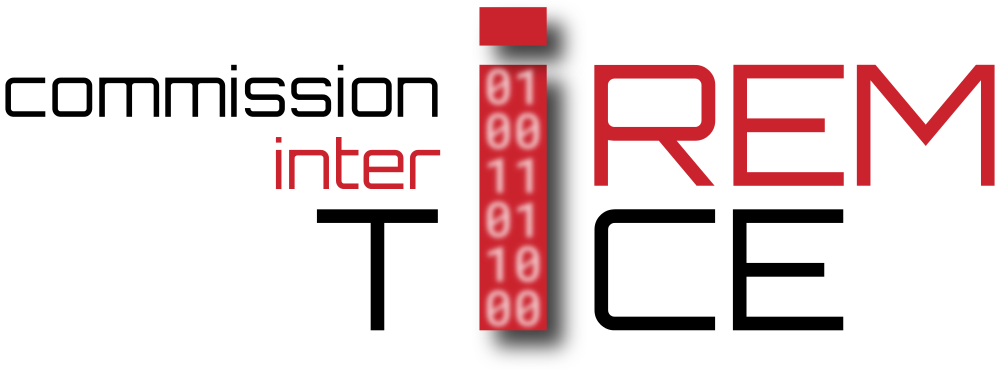

# La carte Micro:bit pour enseigner les mathématiques

Depuis plusieurs années, la commission inter IREM TICE s'intéresse à la carte Micro:bit. Cette dernière, fabriquée pour initier à l'algorithmique l'ensemble des petites collégiens britannique, est accompagnée d'un écosystème diversifié qui permet aussi bien l'initiation à la programmation par bloc (de type blockly ou Scratch) que la programmation évènementielle, impérative ou objet en Python.

La Commission inter IREM TICE propose un diaporama de présentation de la carte et de son écosystème.

diaporama en ligne : [cliquer ici](https://iremlp.github.io/c2it-diapo-microbit/build/export/index.html#/)

## Qui sommes nous ?

La Commission Inter-IREM TICE (C2i TICE) est intégrée aux \textbf{IREM}.

Le réseau des Instituts de Recherche sur l’Enseignement des Mathématiques (IREM) associe des enseignants du primaire, du secondaire et du supérieur, pour mener en commun des réflexions sur l’enseignement des mathématiques et proposer ensuite des formations, des textes ou des publications aux professeurs de cette discipline.

Les commissions Inter-IREM sont des groupes de travail constitués de membres de différents IREM. Certaines sont centrées sur un cycle d’études, telles la COPIRELEM et les commissions Collège ou Lycée, d’autres sur un thème, telles les commissions Épistémologie, TICE ou Statistiques et probabilités, d’autres sur un type d’activité, telle la commission Repères IREM ou Publimath.

La Commission Inter-IREM TICE (C2i TICE) s’intéresse à tous les aspects relatifs aux TICE (Technologie de l’Information et de la Communication pour l’Enseignement) dans l’enseignement des mathématiques.
Elle a pour objectifs de : faire le point sur les différentes utilisations des TICE ; collecter, orienter, structurer et harmoniser les travaux de recherche au sein des IREM ; ouvrir de nouveaux champs de recherche concernant l’utilisation de l’outil numérique ; préparer et intervenir à des colloques et universités d’été en collaboration avec les organismes institutionnels ; suivre les évolutions techniques et réfléchir à leur intérêt pour l’enseignement.