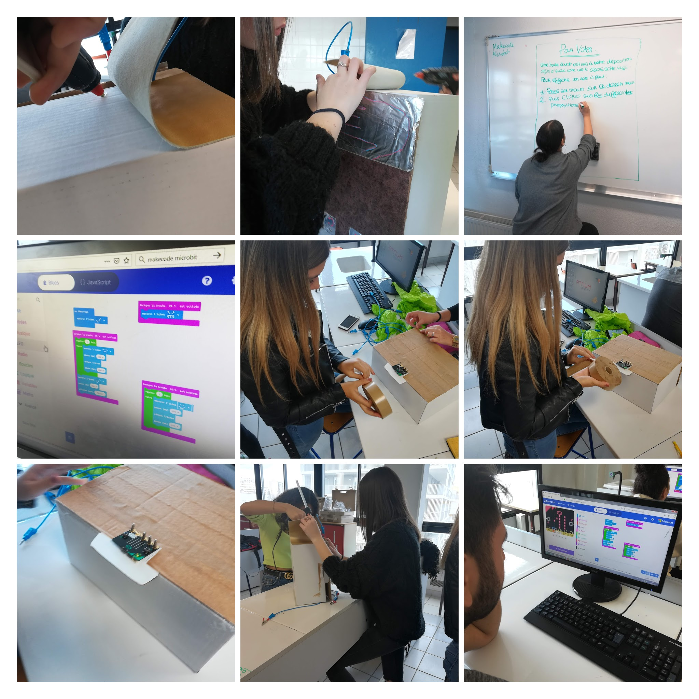
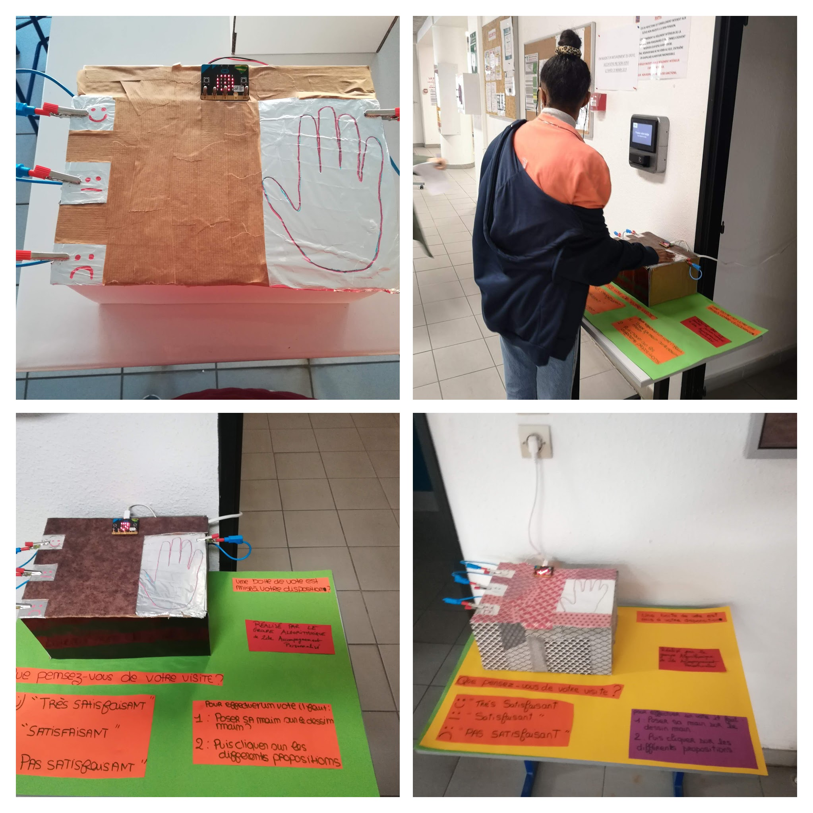

::: block
*C2i-TICE* {style=background:rgba(204,35,50,1);width:500px}
::: 


<div class="tweet"  data-src="https://twitter.com/Irem_Tice/status/845221861231394817?s=20"></div>


---


## Pourquoi utiliser une carte programmable ?


* pour modéliser les objets de notre environnement
* pour mesurer et communiquer
* pour faire des maths


--


## Pourquoi utiliser une carte 
# Micro:Bit?


{width=65%}

--

#### Pourquoi utiliser une carte Micro:Bit?

* Par ses **caractéristiques techniques** et ses **interfaces pédagogiques**, cet objet possède un fort potentiel pour l’enseignement de l’algorithmique.


* Une carte programmable directement : 
  * par bloc 
  * en Python


--


#### Pourquoi utiliser une carte Micro:Bit?

* Petit objet robuste
* Prix raisonnable
* Nombreuses extensions disponibles

--

#### Caractéristiques de la carte Micro:bit

* microcontrôleur développé au Royaume-Unis
* initiative de la BBC pour équiper tous les collégiens anglais (2016)


--

#### Caractéristiques de la carte Micro:bit

* possibilités d'interactions avec l'environnement

{width=45%}
{width=45%}


##### capteurs intégrés

écran LED, bouton, broches, radio/bluetooth, compas magnétique, accéléromètre, température, luminosité


--

### Découverte de la programmation en stage


{width=40%}
{width=40%}


--

### Escape game en stage

{width=45%}
{width=45%}


--

### Projet en classe




--


### Création de boîtiers de satisfaction




--

## Connexion en direct entre la carte et l'ordinateur

<!-- .slide: data-background-video="./res/mu.mp4" data-background-video-loop="true" data-background-size="contain" -->


--


## Robots communicants 


<video loop data-autoplay src="./res/danse_robots.mp4" width="75%"></video>


--


---


# Programmation par blocs


--


## Makecode

<video loop data-autoplay src="./res/makecode.mp4" width="75%"></video>


* interface en ligne [https://makecode.microbit.org/](https://makecode.microbit.org/)
* programmation par bloc ou en javascript
* simulateur


--

## 1 clic !

<video loop data-autoplay src="./res/makecode-tuto.mp4" width="75%"></video>

* transfert sur la carte par copier/coller
* rien à installer


--


---


# Programmation Python


--

## Programmer la carte directement en Python

{width=100%}

Logiciel **mu**

(Windows / iOS / Linux)

https://codewith.mu/


--

### Quelques commandes de base...

;) 

--


## Afficher un texte

```python
from microbit import *
display.scroll("Hello,")
display.show("World!")
```

--


## Terminal et sortie graphique

```python
from microbit import *
import random
nb1 = 0
total = 0
for i in range(100):
    tirage = random.randint(0,1)
    total = total + 1
    nb1 = nb1 + tirage
    nb0 = total - nb1
    print((nb1/total, nb0/total))
    sleep(5)
```

--


## Des images

```python
from microbit import *
display.show(Image.HAPPY)
sleep(1000)
display.show(Image.ANGRY)
sleep(1000)
display.clear()
```

--


## Les boutons

```python
from microbit import *
sleep(10000)
display.scroll(str(button_a.get_presses()))
```

--


## Le mouvement

```python
from microbit import *
while True:
	capteur = accelerometer.get_x()
	if capteur > 40:
		display.show(Image.ARROW_E)
	elif capteur < -40:
		display.show(Image.ARROW_W)
	else:
		display.show("-")
```

--


## Les gestes

```python
from microbit import *
import random
button_b.was_pressed()
while True:
    display.show("8")
    if accelerometer.was_gesture("shake"):
        display.clear()
        sleep(1000)
        display.scroll(random.choice(["Oui","Non"]))
    if button_b.was_pressed():
    	display.clear()
        break
```

--


## La radio

```python
from microbit import *
import radio
import random
while True:
    if button_a.was_pressed():
        radio.send("A")
    if button_b.was_pressed():
        radio.send("B")
    # récepteur
    incomming = radio.receive()
    if incomming == "A":
        display.scroll("A")
    if incomming == "B":
        display.scroll("B")
    sleep(20)

```

--


---


## Activité de recherche

On utilise une boucle de *n* itérations pour
allumer aléatoirement les diodes du Micro:bit.

{width=20%}


#### Combien d'itérations sont nécessaires pour allumer toutes les diodes ?


--


::: block
*C2i-TICE* {style=background:rgba(204,35,50,1);width:500px}
::: 


# Merci
